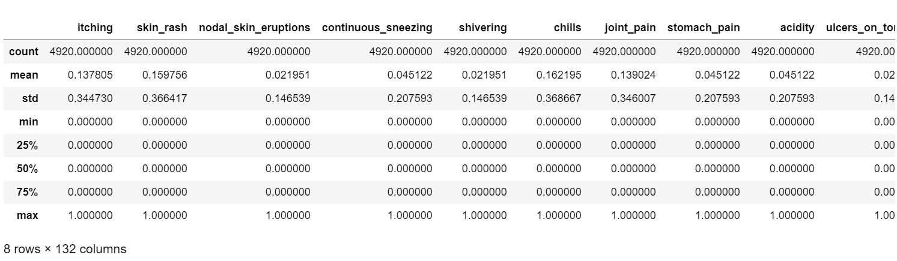
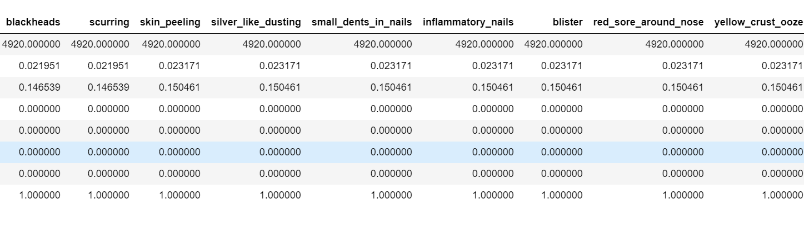
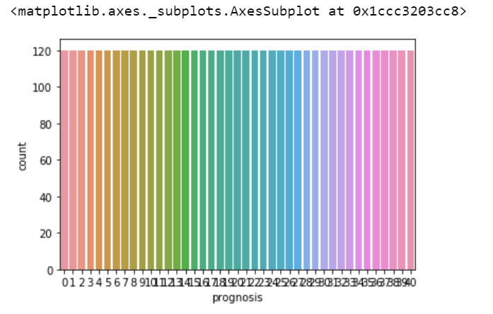
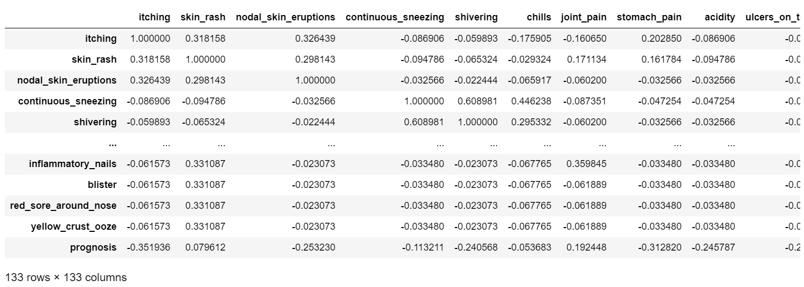
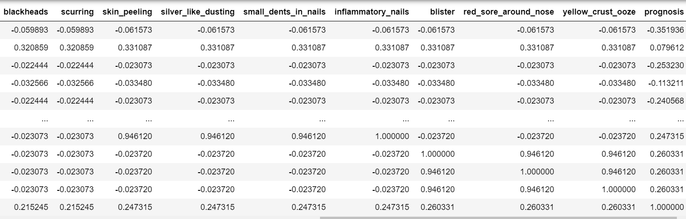
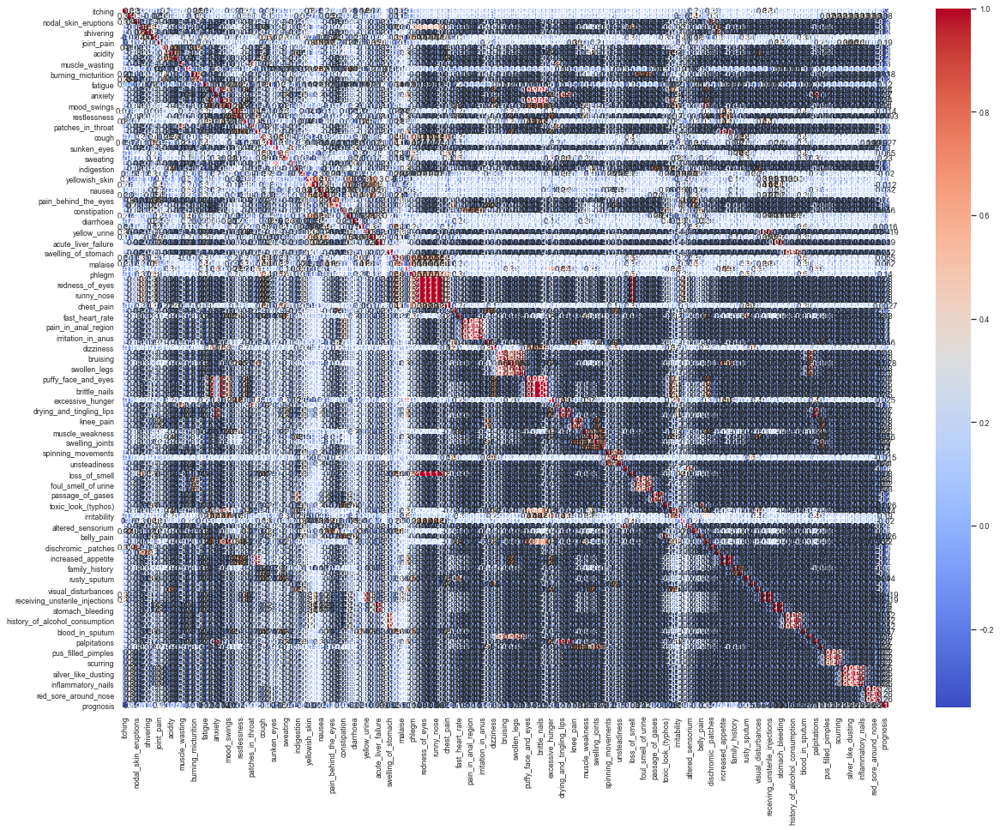

# Symptoms Checker using Machine Learning
Identify possible conditions and treatment related to your symptoms. Help you understand what your medical symptoms could mean.

This dataset is downloaded from Kaggle and the link is mentioned below: https://www.kaggle.com/kerneler/starter-symptom-checker-aaf68256-4

The steps included in this analysis are:

1.Data Collection
2.Data Analysis
3.Data Visualization
4.Data Cleaning
5.Algorithm selection
6.Prediction
7.Saving the Model

### Importing Libraries
```
import pandas as pd
import seaborn as sb
from matplotlib.pyplot import scatter as sm
import matplotlib.pyplot as plt
from sklearn.linear_model import LogisticRegression
from sklearn.model_selection import train_test_split as tts
from sklearn.metrics import confusion_matrix
```

## Step 1: Data Collection

### Collecting the data into dataframe from the local machine
```
data = pd.read_csv('symptoms.csv')
```
## Step 2: Data Analysis

In this dataset, the target attribute is 'Prognosis', which shows the disease based on the observations of different symptom. Hence, Its a classification problem as records need to be classified.

### Shows the number of rows and columns in the dataset (rows,columns).
```
data.shape
(4920, 133)
```
### Check first 5(default) values in dataset
```
data.head()
```


### Check last 5(default) values in dataset
```
data.tail()
```


### Information about dataset
```
data.info()

Output:
<class 'pandas.core.frame.DataFrame'>
RangeIndex: 4920 entries, 0 to 4919
Columns: 133 entries, itching to prognosis
dtypes: int64(132), object(1)
memory usage: 5.0+ MB
```
### Statistical information about dataset
```
data.describe()
```



### To get unique elements from a columns
```
data['prognosis'].unique()

Output:
array(['Fungal infection', 'Allergy', 'GERD', 'Chronic cholestasis',
       'Drug Reaction', 'Peptic ulcer diseae', 'AIDS', 'Diabetes ',
       'Gastroenteritis', 'Bronchial Asthma', 'Hypertension ', 'Migraine',
       'Cervical spondylosis', 'Paralysis (brain hemorrhage)', 'Jaundice',
       'Malaria', 'Chicken pox', 'Dengue', 'Typhoid', 'hepatitis A',
       'Hepatitis B', 'Hepatitis C', 'Hepatitis D', 'Hepatitis E',
       'Alcoholic hepatitis', 'Tuberculosis', 'Common Cold', 'Pneumonia',
       'Dimorphic hemmorhoids(piles)', 'Heart attack', 'Varicose veins',
       'Hypothyroidism', 'Hyperthyroidism', 'Hypoglycemia',
       'Osteoarthristis', 'Arthritis',
       '(vertigo) Paroymsal  Positional Vertigo', 'Acne',
       'Urinary tract infection', 'Psoriasis', 'Impetigo'], dtype=object)
```
Gives all the diseases specified in the prognosis column
### Replace 'object' categorical data with numerical by creating a dictionary for the values to be replaced
```
classes={'Fungal infection':0,'Allergy':1,
         'GERD':2,'Chronic cholestasis':3,'Drug Reaction':4,'Peptic ulcer diseae':5, 'AIDS':6, 'Diabetes ':7,
       'Gastroenteritis':8, 'Bronchial Asthma':9, 'Hypertension ':10, 'Migraine':11,
       'Cervical spondylosis':12, 'Paralysis (brain hemorrhage)':13, 'Jaundice':14,
       'Malaria':15, 'Chicken pox':16, 'Dengue':17, 'Typhoid':18, 'hepatitis A':19,
       'Hepatitis B':20, 'Hepatitis C':21, 'Hepatitis D':22, 'Hepatitis E':23,
       'Alcoholic hepatitis':24, 'Tuberculosis':25, 'Common Cold':26, 'Pneumonia':27,
       'Dimorphic hemmorhoids(piles)':28, 'Heart attack':29, 'Varicose veins':30,
       'Hypothyroidism':31, 'Hyperthyroidism':32, 'Hypoglycemia':33,
       'Osteoarthristis':34, 'Arthritis':35,
       '(vertigo) Paroymsal  Positional Vertigo':36, 'Acne':37,
       'Urinary tract infection':38, 'Psoriasis':39, 'Impetigo':40}

data.replace({'prognosis':classes},inplace=True)
```
## Step 3: Data Visualization
### To plot bar graph for prognosis
```
sb.countplot(data['prognosis'])
```

It shows the count of the records related to different diseases
There are 41 diseases in this data set and all have equal number of data 
### To coount prognosis instances
```
data['prognosis'].value_counts()

Output:
39    120
33    120
25    120
21    120
17    120
13    120
9     120
5     120
1     120
40    120
36    120
32    120
28    120
24    120
20    120
16    120
12    120
8     120
4     120
29    120
37    120
35    120
2     120
31    120
27    120
23    120
19    120
15    120
11    120
7     120
3     120
38    120
34    120
30    120
26    120
22    120
18    120
14    120
10    120
6     120
0     120
Name: prognosis, dtype: int64
```
120 records of patients having these diseases are present in this data set
### To show the correlation between 2 attributes
```
data.corr()
```



### Heatmap
```
plt.subplots(figsize=(20,15))
sb.set(font_scale=0.8)
x=sb.heatmap(data.corr(),annot=True,cmap='coolwarm')  #now it shows correlation between the attributes
plt.show()
```

Heat map is used to find the correlation betweeen attributes and the attributes that are less correlated to eachother and highly correlated to the target variable have to be kept for analysis. If the two attriubtes other than the target variable is kept for analysis, it decreases the accuracy of the model.This heatmap is unclear as there are large set of data.
## Step 4: Data Cleaning
Drop a coloumn or remove null values to improve the accuracy.
Here, there are no useless coloumns to be deleted.
### Drop null values, if any
```
data.dropna(inplace=True)
```
## Step 5: Algorithm Selection
This is a classification problem as the target attribute has 41 instance which are from 0 to 40 to predict the disease from the symptom. So, the people have to be classified to these groups.As this is a classification problem, I am using "Logistic Regression" algorithm.
### CREATE ARRAYS (x=features, y=target)
```
x=data.iloc[:,:-1].values 
y=data.iloc[:,-1].values 
```
### Find the random state and test size that gives highest accuracy
```
 for i in range(1,1000):
           print(i)
           x_train,x_test,y_train,y_test=tts(x,y,test_size=0.2,random_state=i)
           from sklearn.linear_model import LogisticRegression
           logreg=LogisticRegression()   #creating object
           logreg.fit(x_train,y_train)
           loregaccuracy=logreg.score(x_test,y_test)
           print(loregaccuracy*100)
 ```
 ```
 Output:
 1
100.0
2
100.0
3
100.0
4
100.0
5
100.0
6
```
From this,we can conclude that for every test size and random state ,the accuracy is 100%
### Dividing values to training and testing set.
```
x_train,x_test,y_train,y_test=tts(x,y,test_size=0.8,random_state=2)
```
### Check size of train and test data
```
print(x_train.shape)

Output:
(3936, 132)
print(x_test.shape)

Output:
(984, 132)
print(y_train.shape)

Output:
(3936,)
print(y_test.shape)

Output:
(984,)
```
### Creating Object
```
logreg=LogisticRegression()
```
### learning step (give data to model to learn)
```
logreg.fit(x_train,y_train)

LogisticRegression(C=1.0, class_weight=None, dual=False, fit_intercept=True,
                   intercept_scaling=1, l1_ratio=None, max_iter=100,
                   multi_class='auto', n_jobs=None, penalty='l2',
                   random_state=None, solver='lbfgs', tol=0.0001, verbose=0,
                   warm_start=False)
```
 ### Testing step (give new data and test algo efficienccy)
 ```
 loregaccuracy=logreg.score(x_test,y_test)
loregaccuracy*100

Output:
100.0
```
## Step 6: Prediction
This model has accuracy of 100.0% in predicting the disease.
### To check predicted values
```
logregpred=logreg.predict(x_test)
logregpred 

Output:
array([11, 22, 16, 35, 25, 21, 12, 27, 32,  4, 21, 25, 37, 14, 23, 16, 13,
        8,  9,  8, 13, 24, 12, 23, 21, 33,  7, 19, 14, 13,  3, 19, 18, 15,
       21,  1, 31, 20, 11,  7, 19, 32, 39, 13, 11,  8, 38,  6, 27, 16, 28,
       15, 38, 34, 28, 23, 24, 35,  8, 15, 38, 25, 15, 20, 12,  1, 29, 33,
        4,  3, 10, 11, 34, 27,  7,  6, 16,  4,  8, 17, 29, 37, 20,  7, 30,
        5, 16, 22, 17, 18, 30, 26, 24,  4,  6, 26, 11, 18, 18, 24, 18, 17,
       33, 32, 20, 39, 21, 23, 31, 35, 10, 26, 27, 29, 40, 18, 22,  0,  5,
        7, 17, 31,  0, 14, 23, 35, 34,  8,  6,  4, 10, 14, 33, 39,  7, 23,
       24, 39, 24, 26, 26, 21,  6, 35,  1, 25, 33, 36, 36, 17, 34, 13, 36,
       38, 13, 33, 39, 34,  0,  3, 15, 34, 35, 34, 37, 24, 11, 33,  2, 28,
       11, 29, 37, 39, 33, 13, 36,  0, 20, 35, 34, 12,  9, 16,  0, 23,  5,
       32, 21, 17,  4, 24, 15,  9, 10, 30, 33, 20, 18,  3, 29, 32, 15,  9,
        8, 30, 18, 12, 19, 22, 35, 35,  7,  9, 23, 15, 33, 11, 35,  4,  0,
       34, 37, 14, 24, 26,  2, 36,  6, 15, 32, 24, 33,  7, 18, 26, 19, 40,
        9,  4, 28,  1, 39, 11, 36, 26, 28, 24, 18, 15, 12, 27, 28, 23,  1,
        8, 22, 25,  6, 35, 28,  2, 39,  6,  3, 31, 28, 19, 21,  6,  2, 14,
        9, 37, 27, 14, 14,  5,  4, 15,  1, 21, 20, 38, 22, 37, 30, 10, 20,
       18, 35, 29,  2, 38, 32,  0, 10, 35, 39, 22,  1, 25, 14, 30, 23, 12,
        7,  6, 29, 29,  4, 15,  7, 20, 20,  5, 27,  3,  7, 11, 21, 35, 26,
        0,  2, 34, 28,  6, 15, 31,  1, 24, 12,  3,  7, 33, 38, 19, 14, 13,
       11, 19,  2, 19, 11, 40,  2, 18,  0, 33, 33, 11, 25, 34, 24, 24, 37,
       39,  2, 14, 17, 15, 17, 13, 25,  4, 34,  7, 34, 38, 32,  6,  7,  3,
       36,  8, 14, 37, 23, 34, 14, 32, 37, 29, 21, 34, 35,  2, 20,  3, 27,
       35,  2, 10, 19, 27,  0,  9, 28,  4,  9, 34, 39, 33, 33, 27, 26,  7,
       28,  0, 21, 22, 17, 37, 21, 27,  6,  2, 36, 30, 33, 19, 40,  5, 38,
       13,  5, 25, 34, 18,  5, 35,  3,  0, 28, 13, 31, 26,  6,  8, 29, 17,
        7,  4, 27,  8, 16,  0,  9, 21, 24, 30, 29, 32, 29, 24, 21, 33, 11,
       24, 25,  4,  4, 33,  8, 26, 14, 11, 12, 24, 20, 19, 38, 37, 39, 13,
       36, 36, 12, 13, 14, 26,  5, 21, 19, 23, 19, 31, 16, 36, 23,  2,  0,
       11, 14, 21,  1,  5, 24, 35,  2, 31, 32, 35, 38, 31, 13, 17, 10, 21,
       14, 38, 19,  4,  5, 23,  9,  5, 24, 31, 18, 32, 38, 23,  6, 13, 35,
       25,  5,  0, 32, 25, 14,  0, 12, 17,  3,  6, 40,  4, 22, 28, 30, 14,
        7, 25, 22, 15, 18, 28,  9, 39,  5,  6, 20, 33, 40,  8, 16, 35, 10,
       11,  7, 22, 12, 19, 21, 13, 22, 27, 17, 29, 30, 21,  5, 26,  1, 23,
        5,  8, 37,  4, 18, 36, 21,  8, 37, 11, 17,  7, 36,  7, 29, 11, 27,
       20, 32,  2, 29, 29, 32, 40, 30,  6, 18, 16,  5, 11, 34, 39, 12, 25,
       39,  9, 24, 32, 36, 34, 31, 12,  5,  3, 34, 36,  6, 40, 29, 26, 39,
        6, 29, 18, 15, 19,  5,  0, 26, 39,  5, 27, 27,  1, 28, 26, 37,  7,
       10,  5, 20, 17, 17, 26,  2, 14, 15, 31, 30,  4, 33, 37,  5, 21,  5,
        9,  1, 31,  4, 37, 13, 22,  1, 20,  2,  7, 28, 34,  4, 21, 17,  6,
       13, 10,  1, 30, 23, 11,  7,  3, 17, 24, 33, 16, 19,  1,  3, 34, 31,
       24, 40,  8,  3,  2, 27, 29, 16, 15, 18, 27,  7,  7, 31, 13,  7, 31,
       10, 14, 10, 34, 33, 20,  4, 19, 36,  8, 18, 19, 23, 22, 32, 32, 10,
       36, 18, 15, 35,  2, 11,  0, 32, 13, 16, 24,  8,  5,  4, 25, 32, 15,
       20, 15,  0, 30, 35, 37, 28, 26, 21, 34,  6, 31, 29, 37, 12,  6, 19,
       21, 29, 16, 21,  0, 10, 10, 35, 36, 28, 26,  1, 24, 25, 11, 39, 14,
       13,  7, 20,  8, 24, 40,  4, 11, 40, 38, 11, 20,  5, 36, 33,  5, 15,
       30,  9, 32, 21, 36, 22, 20, 18, 18, 10,  5,  5,  4,  1, 20, 19, 14,
       27, 35, 39,  8, 36,  7, 26,  3, 22,  6, 37,  0, 37, 37, 37,  8, 26,
       29, 29, 32, 22, 37,  8, 38,  0, 36, 33,  3, 13,  4,  6, 34,  2, 28,
       34, 23,  7, 34, 38,  8, 29, 33,  1, 33, 25,  6, 33, 13, 15, 11,  2,
        5, 33,  0,  4,  6, 21, 21, 26, 26, 39, 15, 30, 35, 20,  5, 35, 11,
       13, 40, 11, 40, 37, 10, 20, 32, 12, 35, 26, 39, 37, 28, 40, 31, 40,
       15, 40,  9, 37, 15, 18, 13, 35, 17, 37, 18,  2,  6, 22, 13, 39,  3,
       20, 24, 30, 17,  2,  7,  0, 37, 20, 19,  4, 29,  0, 40, 30, 12, 24,
       17, 21, 23, 24,  4, 15, 29, 15, 24, 11, 40,  8,  9, 30, 37, 28,  9,
       27, 39, 14, 35,  8, 11, 13, 21, 16, 17,  4, 16, 15, 38, 19, 32, 18,
       21,  6, 22, 23,  7, 38,  0,  1, 25, 32, 33, 15, 12,  6, 18],
      dtype=int64)
 ```
 ### compare right vs wrong predictions
 y_test has actual answer from 0 to 40 of different diseses and x_test has what it actually predicted 
Here its comparing those 2 to know how many matches and how many do not
```
conmat=confusion_matrix(y_test,logregpred)
conmat

Output:
array([[26,  0,  0, ...,  0,  0,  0],
       [ 0, 19,  0, ...,  0,  0,  0],
       [ 0,  0, 23, ...,  0,  0,  0],
       ...,
       [ 0,  0,  0, ..., 18,  0,  0],
       [ 0,  0,  0, ...,  0, 23,  0],
       [ 0,  0,  0, ...,  0,  0, 18]], dtype=int64)
```
## Step 7: Saving the Model
To save the created model for future prediction
```
 file_name=open('symptomIdentifier.pkl','wb')   #write binary file
 model_name=logreg
 pickle.dump(model_name,file_name)
 ```
### Loading model
This model can be used again in future by importing, for analysing similar dataset without having to do all the above steps.
```
loaded_model=pickle.load(open('symptomIdentifier.pkl','rb'))
```
### Using loaded model
```
loaded_model.score(x_test,y_test)

Output:
1.0
```
