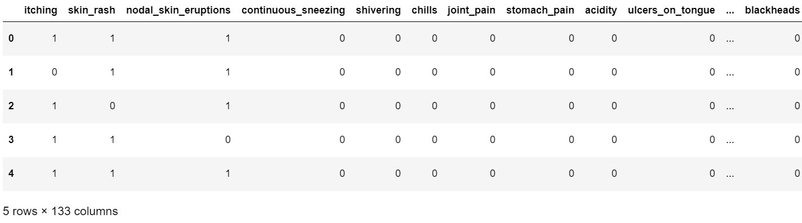
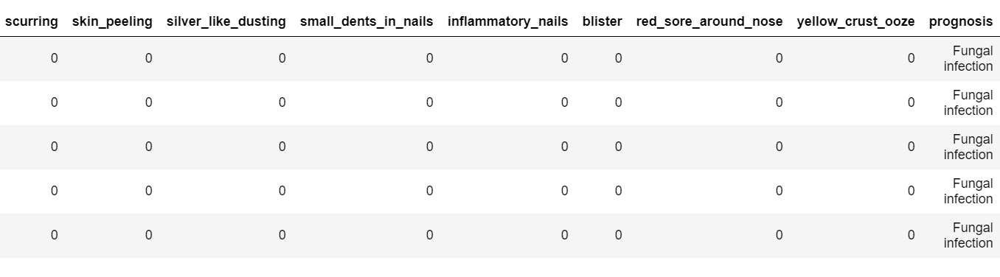
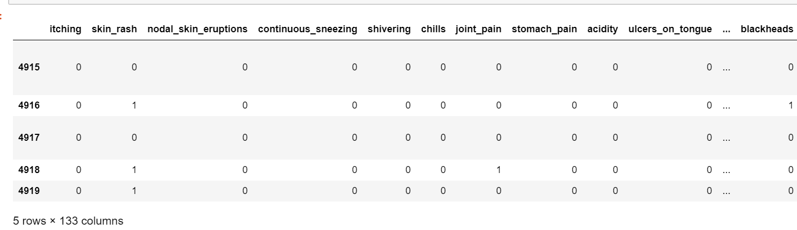
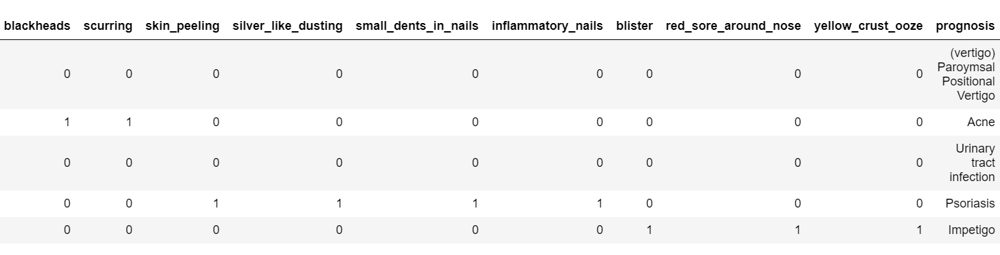

# Symptoms Checker using Machine Learning
Identify possible conditions and treatment related to your symptoms. Help you understand what your medical symptoms could mean.

This dataset is downloaded from Kaggle and the link is mentioned below: https://www.kaggle.com/kerneler/starter-symptom-checker-aaf68256-4

The steps included in this analysis are:

1.Data Collection
2.Data Analysis
3.Data Visualization
4.Data Cleaning
5.Algorithm selection
6.Prediction
7.Saving the Model

### Importing Libraries
```
import pandas as pd
import seaborn as sb
from matplotlib.pyplot import scatter as sm
import matplotlib.pyplot as plt
from sklearn.linear_model import LogisticRegression
from sklearn.model_selection import train_test_split as tts
from sklearn.metrics import confusion_matrix
```

## Step 1: Data Collection

### Collecting the data into dataframe from the local machine
```
data = pd.read_csv('symptoms.csv')
```
## Step 2: Data Analysis

In this dataset, the target attribute is 'Prognosis', which shows the disease based on the observations of different symptom. Hence, Its a classification problem as records need to be classified.

### Shows the number of rows and columns in the dataset (rows,columns).
```
data.shape
(4920, 133)
```
### Check first 5(default) values in dataset
```
data.head()
```




### Check last 5(default) values in dataset
```
data.tail()
```



### Information about dataset
```
data.info()
<class 'pandas.core.frame.DataFrame'>
RangeIndex: 4920 entries, 0 to 4919
Columns: 133 entries, itching to prognosis
dtypes: int64(132), object(1)
memory usage: 5.0+ MB
```
### Statistical information about dataset
```
data.describe()
```
